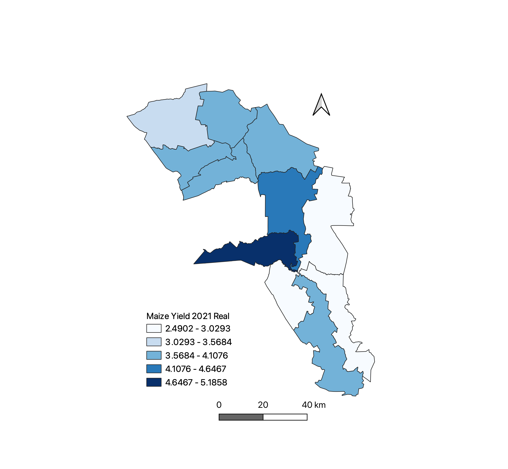
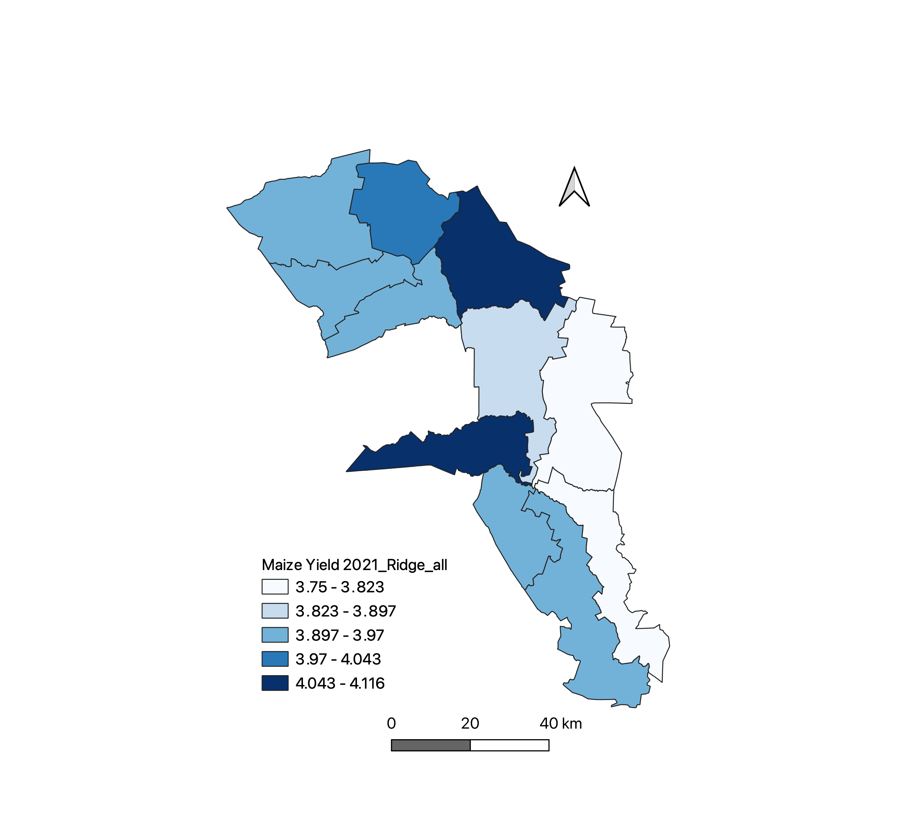
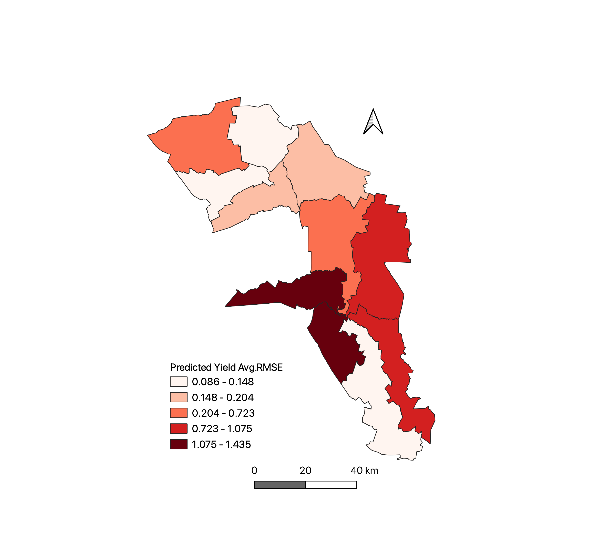
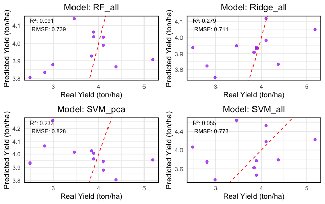

# Maize Yield Prediction in Kenya Using Machine Learning

**M.Sc. Thesis | Humboldt-Universität zu Berlin | Grade: 1.0**
**Study area:** Trans Nzoia and Uasin Gishu counties, western Kenya (11 sub-counties)
**Period:** 2017–2021 (training: 2017–2020, testing: 2021)

---

## Project Overview

This project predicts sub-county level maize yield in western Kenya under data-scarce
conditions using machine learning models trained on multi-source Earth observation
and environmental datasets. The core challenge was building robust predictive models
with only 55 observations across 11 sub-counties and 44 variables spanning climate,
soil, and vegetation data.

The project was completed independently, with all data processing, modelling, and
analysis carried out in R and Google Earth Engine.

---

## Research Questions

1. Which climatic, soil, and vegetation factors most strongly predict maize yield in
   Trans Nzoia and Uasin Gishu?
2. How do machine learning models compare in predictive skill under data-scarce
   conditions?
3. Does PCA-based dimensionality reduction improve or reduce model performance?

---

## Data Sources

| Dataset | Variable type | Source |
|---|---|---|
| CHIRPS | Precipitation (avg, max) | Climate Hazards Group |
| MODIS | NDVI, EVI, SAVI | NASA/Google Earth Engine |
| SoilGrids | Soil properties (SSAT, SLOC, SBDM, clay, silt) | ISRIC |
| Kenya Bureau of Statistics | Maize yield (tons/ha) | KNBS |

**Total variables:** 44 (full dataset) / 15 (PCA-selected)
**Observations:** 55 (11 sub-counties x 5 years)

---

## Methodology

### 1. Data Processing
- Integrated multi-source datasets via Google Earth Engine and R
- Extracted monthly climate and vegetation metrics per sub-county
- Standardised and scaled features for ML model compatibility

### 2. Dimensionality Reduction
- Applied PCA to address multicollinearity across 44 variables
- Retained 6 principal components explaining 91% of total variance
- Selected 15 variables for PCA-reduced model comparison

**PCA-selected variables:**

| Type | Variables |
|---|---|
| Precipitation | PrecMax_Jun, PrecMax_Aug, PrecAvg_Apr, PrecAvg_May, PrecAvg_Aug |
| Vegetation | SAVI_plant, NDVI_plant, NDVI_grow |
| Soil | SBDM, SLOC |
| Temperature | Tmax_May, Tmax_Sep, Tmin_Jun, Tmin_Jul, Tmin_Sep |

### 3. Machine Learning Models
Six model families evaluated across full and PCA-selected variable sets:
- Ridge Regression (L2 regularisation)
- LASSO Regression (L1 regularisation)
- Partial Least Squares Regression (PLSR)
- Random Forest (RF)
- Gradient Boosting Machine (GBM)
- Support Vector Machine — 4 kernel configurations (linear, tuned linear, RBF, polynomial)

### 4. Validation Framework
- Temporal hold-out: trained on 2017–2020, tested on 2021
- 10-fold cross-validation on training set
- Evaluated using RMSE and R²

---

## Key Results

**Best performing model:** Ridge Regression (all variables)
- Validation R²: 0.37 | Testing R²: 0.28
- Most consistent balance between training fit and generalisation

**SVM2 with PCA** achieved highest validation R² (0.55) and lowest testing RMSE (0.83
ton/ha), demonstrating that dimensionality reduction improved SVM generalisation.

**Tree-based models** (RF, GBM) showed strong training performance (R² ~0.91) but
poor generalisation, indicating overfitting under data-scarce conditions.

### Top Predictors

| Model | Top variables |
|---|---|
| Ridge | SSAT, SAVI_grow, SBDM, SAVI_plant, SLOC |
| Random Forest | Tmax_Mar, Tmin_Apr, PrecAvg_Mar, Tmin_Sep, SAVI_grow |
| SVM2 (PCA) | NDVI_grow, Tmin_Sep, PrecAvg_Aug, SLOC, Tmin_Jul |

**Key finding:** Soil water saturation (SSAT) and maximum temperature in March–May
(Tmax_Mar, Tmax_May) were the most consistent cross-model predictors, confirming
the critical role of temperature stress during germination and early growth stages.

---

## Tools & Environment

- **R** — modelling, visualisation (ggplot2), PCA, cross-validation
- **Google Earth Engine** — MODIS vegetation index extraction, CHIRPS download
- **QGIS** — spatial visualisation, sub-county boundary mapping
- **Packages:** glmnet, randomForest, gbm, e1071, caret, ggplot2, sf

---

## Outputs

- Sub-county spatial yield prediction maps (actual vs. Ridge and SVM predicted, 2021)
- RMSE heatmap across sub-counties for four model configurations
- Variable importance plots for Ridge, RF, and SVM models
- Predicted vs. actual yield bar chart across 11 sub-counties
markdown## Outputs

**Actual yield distribution (2021)**

**Ridge Regression predicted yield (2021)**

**Average RMSE across sub-counties**

**RMSE heatmap by model and sub-county**

**Predicted vs actual yield scatter plots**

---

## Reflections

The main methodological challenge was the small sample size (55 observations) relative
to the number of predictors (44). This made overfitting a persistent risk across all
non-linear models. Linear models with regularisation (Ridge, LASSO) generalised better
than ensemble methods, which contradicts typical ML benchmarks — a finding specific
to data-scarce settings that has practical implications for agricultural modelling in
regions with limited survey infrastructure.

PCA helped linear models by removing multicollinearity but reduced the ability of
non-linear models (RF, GBM) to capture variable interactions — showing that
dimensionality reduction is not universally beneficial across model types.
